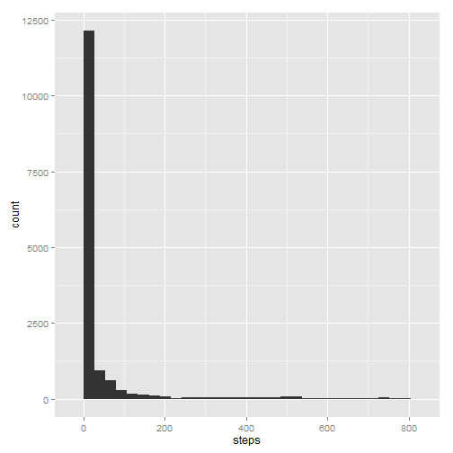
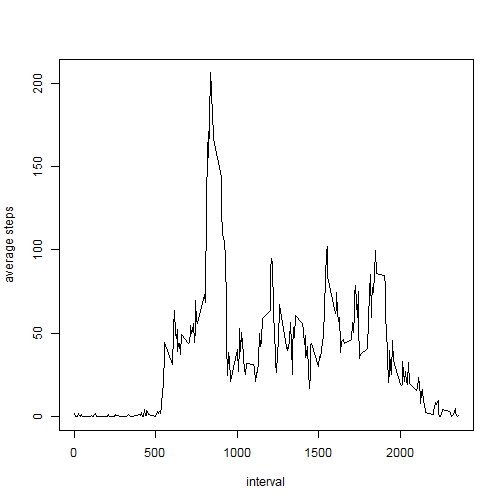
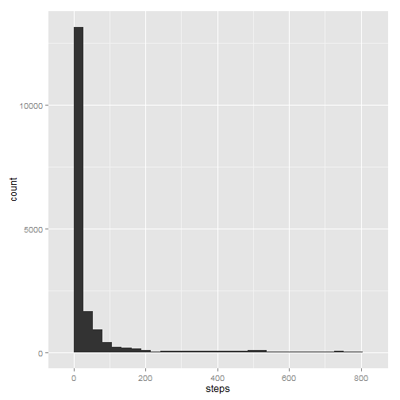
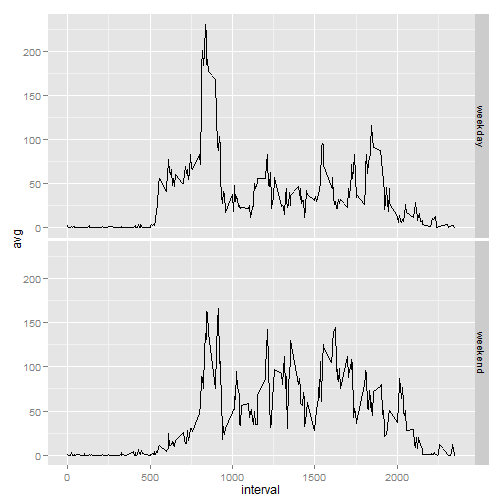

---
---

This is an R Markdown document for Assignment 1 of Reproducible research.

Author:Gaurav Tejwani


```r
#initialize various packages that will be used in the program
library(lubridate)
library(ggplot2)
library(plyr)
library(dplyr)
library(doBy)
#Set directory to folder where data is present
setwd("C:/Users/gt8616/Desktop/Coursera/Rep Res Asg 1")
#read the csv file
data <- read.csv("activity.csv")

#Part 1: Finding mean & median steps and making histogram of steps each day
#subset data based by removing rows where steps = NA
data1 <- data[!(is.na(data$steps)),]
qplot(steps,data=data1,xlab="steps",ylab="count")
```

```
## stat_bin: binwidth defaulted to range/30. Use 'binwidth = x' to adjust this.
```

 

```r
mean <- mean(data1$steps)
median <- median(data1$steps)

#part 2: Average daily activity pattern
avgact <- data1 %.%
          group_by(interval) %.%
          summarize(avg=mean(steps))
plot(avgact$interval,avgact$avg,type = "l",xlab="interval",ylab="average steps")
```

 

```r
#part 3:Imputing missing values
#summary function reveals that only steps has NAs. It also shows total NAs present
summary(data$steps)
```

```
##    Min. 1st Qu.  Median    Mean 3rd Qu.    Max.    NA's 
##     0.0     0.0     0.0    37.4    12.0   806.0    2304
```

```r
summary(data$date)
```

```
## 2012-10-01 2012-10-02 2012-10-03 2012-10-04 2012-10-05 2012-10-06 
##        288        288        288        288        288        288 
## 2012-10-07 2012-10-08 2012-10-09 2012-10-10 2012-10-11 2012-10-12 
##        288        288        288        288        288        288 
## 2012-10-13 2012-10-14 2012-10-15 2012-10-16 2012-10-17 2012-10-18 
##        288        288        288        288        288        288 
## 2012-10-19 2012-10-20 2012-10-21 2012-10-22 2012-10-23 2012-10-24 
##        288        288        288        288        288        288 
## 2012-10-25 2012-10-26 2012-10-27 2012-10-28 2012-10-29 2012-10-30 
##        288        288        288        288        288        288 
## 2012-10-31 2012-11-01 2012-11-02 2012-11-03 2012-11-04 2012-11-05 
##        288        288        288        288        288        288 
## 2012-11-06 2012-11-07 2012-11-08 2012-11-09 2012-11-10 2012-11-11 
##        288        288        288        288        288        288 
## 2012-11-12 2012-11-13 2012-11-14 2012-11-15 2012-11-16 2012-11-17 
##        288        288        288        288        288        288 
## 2012-11-18 2012-11-19 2012-11-20 2012-11-21 2012-11-22 2012-11-23 
##        288        288        288        288        288        288 
## 2012-11-24 2012-11-25 2012-11-26 2012-11-27 2012-11-28 2012-11-29 
##        288        288        288        288        288        288 
## 2012-11-30 
##        288
```

```r
summary(data$interval)
```

```
##    Min. 1st Qu.  Median    Mean 3rd Qu.    Max. 
##       0     589    1180    1180    1770    2360
```

```r
#Finding NAs in steps and replacing them with mean of time interval
for(i in 1:nrow(data)){
  if(is.na(data[i,1])){
    data[i,1] <- avgact[avgact$interval==data[i,3],2]
  }
}

qplot(steps,data=data,xlab="steps",ylab="count")
```

```
## stat_bin: binwidth defaulted to range/30. Use 'binwidth = x' to adjust this.
```

 

```r
mean1 <- mean(data$steps)
median1 <- median(data$steps)

#part 4:Differences between weekdays and weekends
#create a column indicating day
data$day <- weekdays(ymd(data$date))

data$week[!(data$day %in% c("Saturday","Sunday"))] <- "weekday"

data$week[data$day %in% c("Saturday","Sunday")] <- "weekend"

data$day <- NULL

data$week <- as.factor(data$week)

avgact2 <- data %.%
          group_by(interval,week) %.%
          summarize(avg=mean(steps))

qplot(interval,avg,data=avgact2,facets=week~.,geom="line")
```

 

```

Thank You
